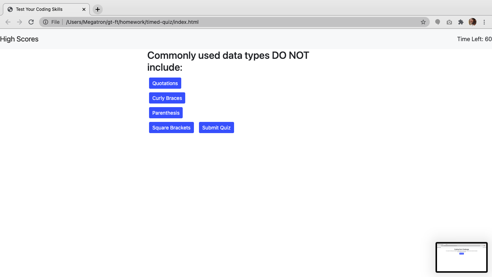
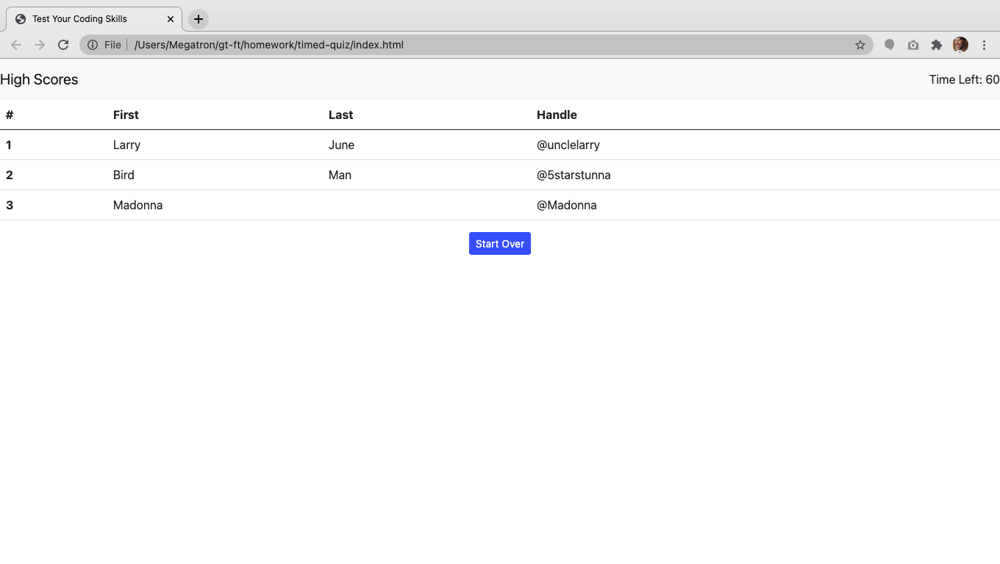

# A Timed Quiz alpha build

## Table of Contents

[About](https://github.com/AndreDiop/timed-quiz/blob/main/README.md#About)

[Installation](https://github.com/AndreDiop/timed-quiz/blob/main/README.md#Access)

[Usage](https://github.com/AndreDiop/timed-quiz/blob/main/README.md#Usage)

[Screenshots](https://github.com/AndreDiop/timed-quiz/blob/main/README.md#Screenshots)

[Contributing](https://github.com/AndreDiop/timed-quiz/blob/main/README.md#Contributing)

[Licenses](https://github.com/AndreDiop/timed-quiz/blob/main/README.md#Licenses)

# About

Utilizing knowledge of elements of Javascript such as eventlisteners, DOM, getters, setters; I attempted to create a timed quiz that presents users with a set of questions that they must complete within a set of time. There should be a time penalty for each wrong answer and at the end of the quiz, user will be given the opportunity to enter their name and social media handle to be displayed on a high score list.

## Access

Users will access the page through either the direct link to the deployed application

```bash
https://andrediop.github.io/timed-quiz/
```

or through the Github repository

```bash
https://github.com/AndreDiop/timed-quiz
```

## Usage
This app is still in the alpha stage and does not have full functionality yet. Additions to be made include, question functionality, adding timer functionality and adding a user input for them to enter high scores


## Screenshots

These screen shots show the timed quiz in different states

```bash
Users are welcomed with this page
```


```bash
Users are presented with multiple choice questions

```


```bash
Users are presented with high score screen upon completion

```



## Contributing

This app could have been built with the help of fellow students, instructors, tutors, and TA's of the GT coding bootcamp.

Please reach out to me if you see ways that I can improve upon my code and complete the functionality.


## License

[MIT](https://choosealicense.com/licenses/mit/)
